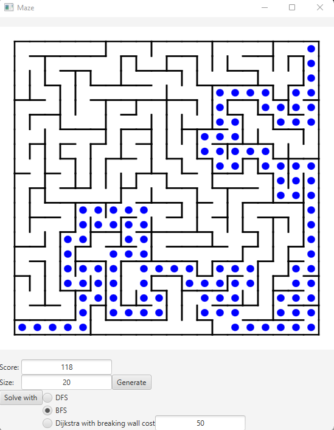

# Java Lab to Illustrate DFS, BFS and Dijkstra

To run (you need [Maven](https://maven.apache.org/)):

```bash
mvn javafx:run
```

The entry of the labyrinth is at the lower left corner and the exit at the upper right one. You can choose the algoritm: [Depth-First Search](https://en.wikipedia.org/wiki/Depth-first_search), [Breadth-First Search](https://en.wikipedia.org/wiki/Breadth-first_search) or [Dijkstra](https://en.wikipedia.org/wiki/Dijkstra%27s_algorithm). A move cost one unit and you can, using Dijkstra, select the cost of going through a wall.

